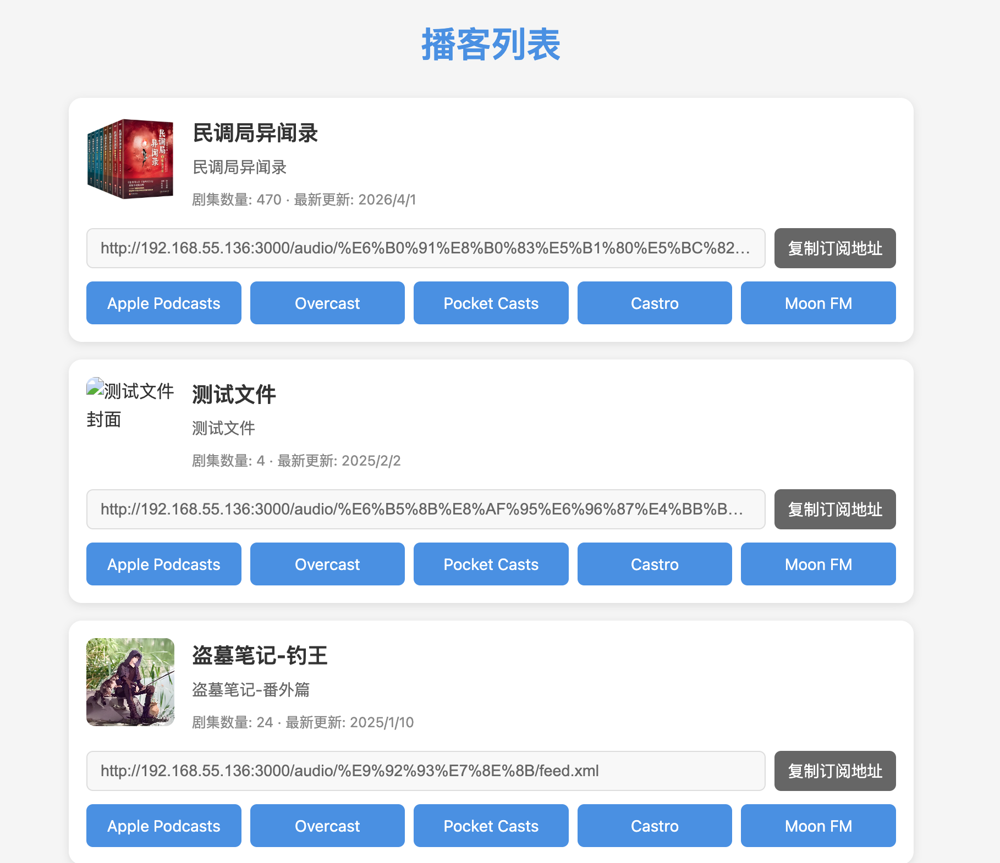

[](https://github.com/Akshay090/svg-banners)

# 🎙️ Folder2Podcast RSS

> Convert local audio folders to private podcast RSS feeds with one command - Zero intrusion, No side effects

[中文版](README.md)

## Table of Contents
- [🎙️ Folder2Podcast RSS](#️-folder2podcast-rss)
  - [Table of Contents](#table-of-contents)
  - [Background](#background)
  - [✨ Features](#-features)
    - [📱 Web Interface](#-web-interface)
    - [🎯 Other Features](#-other-features)
  - [🚀 Quick Start](#-quick-start)
    - [Docker Deployment (Recommended)](#docker-deployment-recommended)
  - [Docker Image Tags](#docker-image-tags)
  - [📦 Directory Structure](#-directory-structure)
    - [Configuration File Location](#configuration-file-location)
  - [⚙️ Configuration](#️-configuration)
    - [Environment Variables](#environment-variables)
    - [podcast.json Configuration](#podcastjson-configuration)
  - [🎨 Advanced Features](#-advanced-features)
  - [📱 Client Support](#-client-support)
    - [Supported Podcast Clients](#supported-podcast-clients)
    - [Usage Flow](#usage-flow)
    - [RSS Best Practices](#rss-best-practices)
  - [Troubleshooting](#troubleshooting)
  - [📋 Support \& Feedback](#-support--feedback)
  - [Changelog](#changelog)

## Background

Podcast RSS is a powerful audio distribution standard that provides:

- 🔖 Complete playback progress tracking
- 🎯 Precise resume playback functionality
- 🔄 Cross-device listening history sync
- 📱 Multi-platform listening support
- 🎨 Rich media information display

Folder2Podcast RSS lets you easily convert local audio folders into private podcast RSS feeds, enjoying all the advanced features of professional podcast clients:

- 🎧 Listen using your favorite podcast apps (like Apple Podcasts, Pocket Casts)
- 📱 Continue from where you left off on any device
- 🔄 Automatically sync listening history across devices
- 📚 Systematically manage your audiobook library
- 🎯 Smart bookmarking for every audio file

Just one command to deploy, transforming your local audio into private podcast feeds instantly.

## ✨ Features

### 📱 Web Interface
The project provides a user-friendly web interface that allows users to:
- View all available podcast sources
- Copy subscription URLs with one click
- One-click subscription support for multiple podcast clients:
  - Apple Podcasts
  - Overcast
  - Pocket Casts
  - Castro
  - Moon FM
  - More clients coming soon...



### 🎯 Other Features
- Smart filename processing
- Automatic serialization
- Cover image management
- Multi-device sync

For detailed information, please refer to [Advanced Guide](docs/advanced-guide.en.md).

## 🚀 Quick Start

### Docker Deployment (Recommended)

1. **Preparation**
   - Install Docker
   - Prepare audio directories (organized by podcast content)
   - Standardize filename format (e.g., 01-Chapter1.mp3, Episode02.mp3)

⚠️ **Important: BASE_URL Configuration**

When deploying to a server, you must properly configure the BASE_URL environment variable, which affects:
- Audio file links in RSS feed
- Cover image links
- All static resource access paths

Configuration examples:
```bash
# For local testing
BASE_URL=http://localhost:3000

# For server deployment (replace with your actual server IP or domain)
BASE_URL=http://192.168.55.222:3000
# or
BASE_URL=http://your-domain.com
```

Important notes:
- BASE_URL must include protocol prefix (http:// or https://)
- Include port number if using custom port
- Don't add trailing slash '/'
- Ensure the address is accessible from client devices (like podcast apps)

2. **Launch Service**

   Option 1: Direct Docker command
   ```bash
   docker run -d \
     -p 3000:3000 \
     -v /path/to/audiobooks:/podcasts \
     -e PORT=3000 \
     -e BASE_URL=http://your-server-ip:3000 \
     -e PUID=$(id -u) \
     -e PGID=$(id -g) \
     yaotutu/folder2podcast
   ```

   Option 2: Using Docker Compose (Recommended)
   ```yaml
   # docker-compose.yml
   version: '3.8'
   services:
     folder2podcast:
       image: yaotutu/folder2podcast
       ports:
         - "3000:3000"
       volumes:
         - ./audiobooks:/podcasts:ro  # Mount in read-only mode
       environment:
         - PORT=3000
         - AUDIO_DIR=/podcasts
         - BASE_URL=http://your-server-ip:3000
         - PUID=1000  # Replace with your user ID
         - PGID=1000  # Replace with your group ID
       restart: unless-stopped
   ```

   > **Permission Note**:
   > - Sometimes Docker container might have trouble accessing your audio files
   > - In such cases, you need to set `PUID` and `PGID` environment variables
   > - These values should match the owner ID of your audio folder
   > - On Mac/Linux, simply run `id -u` and `id -g` in terminal to get these values
   > - Once set correctly, the app will be able to access your audio files normally

3. **Verify Deployment**
   - Visit `http://localhost:3000/podcasts` to confirm service is running
   - Check if podcast list displays correctly
   - Test audio file access

## Docker Image Tags

- `yaotutu/folder2podcast:main` - Development version, synced with main branch, includes latest features
- `yaotutu/folder2podcast:latest` - Stable version, tested and released, recommended for production

## 📦 Directory Structure

Each podcast folder can contain its own `podcast.json` configuration file to customize that podcast's presentation and behavior. This design allows different settings for each podcast series.

### Configuration File Location
```
audiobooks/
├── podcast-series-1/
│   ├── 01-chapter1.mp3
│   └── podcast.json    # Independent config for series 1
└── podcast-series-2/
    ├── 01.intro.mp3
    └── podcast.json    # Independent config for series 2
```

## ⚙️ Configuration

### Environment Variables

The system supports multiple environment variables for customization. Here's the complete list:

| Variable       | Description                        | Default                 | Example                      |
| -------------- | ---------------------------------- | ----------------------- | ---------------------------- |
| `AUDIO_DIR`    | Audio files root directory         | `./audio`               | `/path/to/audiobooks`        |
| `PORT`         | Server listening port              | `3000`                  | `8080`                       |
| `BASE_URL`     | Server base URL for RSS feed links | `http://localhost:PORT` | `http://192.168.55.222:3000` |
| `TITLE_FORMAT` | Episode title display format       | `full`                  | `clean` or `full`            |
| `PUID`         | Audio folder owner ID              | `1000`                  | Run `id -u` to get           |
| `PGID`         | Audio folder group ID              | `1000`                  | Run `id -g` to get           |

Detailed description:

1. **AUDIO_DIR**
   - Purpose: Specify root directory for audio files
   - Default: audio folder in current directory
   - Note: Directory must have read permissions

2. **PORT**
   - Purpose: Specify server listening port
   - Default: 3000
   - Note: Service won't start if port is occupied

3. **BASE_URL**
   - Purpose: Generate URLs in RSS feed
   - Default: `http://localhost:port`
   - Importance: Must be set correctly to ensure audio files are accessible
   - Format: Must include protocol (http/https)

4. **TITLE_FORMAT**
   - Purpose: Control episode title display format
   - Default: `full` (keep complete filename)
   - Options:
     * `full`: Keep complete filename (without extension)
     * `clean`: Remove number prefix and separators

Usage example:

```bash
# Docker run example
docker run -d \
  -p 3000:3000 \
  -v /audiobooks:/podcasts \
  -e AUDIO_DIR=/podcasts \
  -e PORT=3000 \
  -e BASE_URL=http://192.168.55.222:3000 \
  -e TITLE_FORMAT=full \
  yaotutu/folder2podcast
```

Configuration priority:
- Environment variables > Default values
- podcast.json config > Environment variables (for specific podcasts)

### podcast.json Configuration
```json
{
  "title": "Podcast Title",
  "description": "Podcast Description",
  "author": "Author Name",
  "email": "author@example.com",
  "language": "en-us",
  "category": "Technology",
  "explicit": false,
  "websiteUrl": "https://example.com",
  "titleFormat": "clean"
}
```

## 🎨 Advanced Features

## 📱 Client Support

### Supported Podcast Clients

Almost all podcast clients that support custom RSS feeds work:

- Apple Podcasts (iOS, Mac)
- Pocket Casts (All platforms)
- Overcast (iOS)
- Castro (iOS)
- Google Podcasts (Android, Web)
- AntennaPod (Android)

### Usage Flow

1. **Get Subscription Link**
   - Visit `http://your-server:3000/podcasts`
   - Find the podcast series you want to subscribe to
   - Copy the corresponding RSS Feed URL

2. **Add to Podcast Client**
   - Open your preferred podcast client
   - Find "Add Podcast" or "Add RSS Feed"
   - Paste your Feed URL
   - Wait for content to sync

3. **Start Using**
   - All episodes will automatically sync to the client
   - Listening progress syncs across devices
   - Supports background download and offline playback
   - Can add chapter notes (supported by some clients)

### RSS Best Practices

1. **Content Organization**
   - Use clear folder structure
   - Maintain consistent file naming
   - Add high-quality cover images (recommended 1400x1400px)

2. **Performance Optimization**
   - Control the number of audio files per folder
   - Use mp3 format for best compatibility
   - Configure correct BASE_URL to ensure accessibility

## Troubleshooting

## 📋 Support & Feedback

- Found a bug? [Submit Issue](https://github.com/your-repo/folder2podcast/issues)
- Have suggestions? [Join Discussion](https://github.com/your-repo/folder2podcast/discussions)
- Want to contribute? [Submit PR](https://github.com/your-repo/folder2podcast/pulls)

## Changelog

View complete update history in [CHANGELOG.md](CHANGELOG.md)

<div align="center">

<table>
  <tr>
    <td align="center">
      
      <br>
      👆 Scan QR code to join our WeChat group for beta testing!
    </td>
    <td align="center">
      <a href="https://www.producthunt.com/posts/folder2podcast-rss?embed=true">
        
      </a>
      <br>
      <a href="https://starchart.cc/yaotutu/folder2podcast">
        
      </a>
    </td>
  </tr>
</table>

</div>