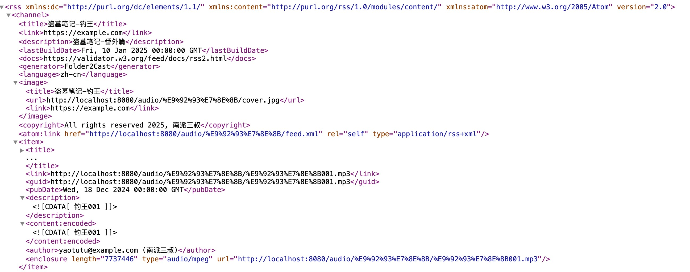

[](https://github.com/Akshay090/svg-banners)

# 🎙️ Folder2Cast

> 将本地音频文件夹转换为标准播客订阅源

Folder2Cast 是一个专业的播客源生成工具，能够将本地音频文件夹转换为符合播客标准的RSS订阅源。通过简单的配置，即可实现音频文件的规范化管理和播放。

## ✨ 核心功能

- 🚀 **便捷部署** - 提供命令行和容器化两种部署方式
- 🎯 **智能序列化** - 基于文件名自动构建剧集顺序
- 🌐 **双路径访问** - 支持原生中文路径和英文别名
- 🔄 **动态更新** - 自动检测文件变更并更新订阅源
- 🎨 **灵活配置** - 支持全局配置和目录级别的个性化设置

## 🚀 快速部署指南

### 使用 Docker 部署（推荐）

1. **环境准备**
   - 安装 Docker
   - 准备音频文件目录
   - 确保文件命名规范（如：01-序章.mp3）

2. **启动服务**
   ```bash
   docker run -d \
     -p 3000:3000 \
     -v /path/to/audiobooks:/podcasts:ro \
     -e PORT=3000 \
     folder2podcast
   ```

3. **验证部署**
   - 访问 `http://localhost:3000/podcasts` 确认服务运行
   - 检查播客列表是否正确显示
   - 测试音频文件访问

### 使用 NPM 部署

1. **环境要求**
   - Node.js 14.0 或更高版本
   - NPM 6.0 或更高版本
   - 准备音频文件目录

2. **安装配置**
   ```bash
   # 克隆项目
   git clone https://github.com/your-repo/folder2podcast.git
   cd folder2podcast

   # 安装依赖
   npm install

   # 配置环境变量（可选）
   export AUDIO_DIR=/path/to/audiobooks
   export PORT=3000
   ```

3. **启动服务**
   ```bash
   # 开发模式
   npm run start:dev

   # 或指定配置启动
   AUDIO_DIR=/path/to/audiobooks PORT=3000 npm run start:dev
   ```

4. **验证服务**
   - 访问管理面板：`http://localhost:3000/podcasts`
   - 确认音频文件可访问
   - 测试播客订阅功能

### 后续配置

无论选择哪种部署方式，您都可以：
- 在各播客目录下添加 podcast.json 自定义配置
- 添加 cover.jpg 设置播客封面（推荐使用正方形图片以获得最佳显示效果）
- 通过环境变量调整全局配置

## 📱 效果展示

### 播客客户端显示效果


*图示：在 Apple Podcasts 中的显示效果*

要获取类似截图：
1. 使用任意播客客户端（如 Apple Podcasts）订阅您的播客
2. 等待内容同步完成
3. 截取播客详情页面的屏幕截图

### RSS Feed 结构



*图示：生成的标准 RSS Feed 结构*

要获取 Feed 截图：
1. 访问您的播客 Feed URL（例如：`http://localhost:3000/audio/your-podcast/feed.xml`）
2. 使用浏览器的开发者工具格式化 XML
3. 截取包含完整结构的屏幕截图

## 📦 目录结构规范

标准的目录结构组织方式：

```
audiobooks/
├── podcast-series-1/
│   ├── 01-第一章.mp3     # 数字前缀用于排序
│   ├── 02-第二章.mp3     # 支持多种分隔符
│   ├── cover.jpg        # 可选：播客封面图片
│   └── podcast.json     # 可选：配置文件
│
└── podcast-series-2/
    ├── 01.序章.mp3      # 标准命名格式
    ├── 02.正文.mp3      # 保持命名一致性
    └── 03.尾声.mp3      # 便于维护管理
```

## ⚙️ 配置文件说明

播客配置文件 `podcast.json` 参数说明：

```json
{
  "title": "播客标题",
  "description": "播客描述",
  "author": "作者名称",
  "alias": "podcast-name",         // 用于URL访问的英文标识符
  "language": "zh-cn",             // 语言代码
  "category": "科技",              // 播客分类
  "explicit": false,               // 内容分级
  "email": "contact@example.com",  // 联系邮箱
  "websiteUrl": "https://example.com", // 相关网站
  "titleFormat": "full"           // 标题格式：clean(清理前缀) 或 full(完整文件名)
}
```

配置说明：
- title/description: 在播客客户端中显示的基本信息
- alias: 必须为小写字母、数字和连字符的组合
- language: 遵循 RFC 5646 标准的语言代码
- explicit: 用于内容分级，标记是否包含敏感内容

## 🎯 一键部署

使用Docker Compose更优雅：

```yaml
version: '3.8'
services:
  folder2podcast:
    image: folder2podcast
    ports:
      - "3000:3000"
    volumes:
      - ./audiobooks:/podcasts:ro
    restart: unless-stopped
    # 可选：健康检查
    healthcheck:
      test: ["CMD", "wget", "-q", "--spider", "http://localhost:3000/podcasts"]
      interval: 1m
      timeout: 10s
```

## 🌐 URL访问规范

系统提供两种标准的URL访问方式：

1. 原始路径访问：
```
http://[服务器地址]/audio/[播客目录名]/feed.xml
```

2. 别名路径访问：
```
http://[服务器地址]/audio/[英文别名]/feed.xml
```

访问规则说明：
- 原始路径：直接使用播客目录名，支持中文编码
- 别名路径：使用podcast.json中配置的alias值，仅支持英文和连字符
- 两种路径均指向相同的资源，提供不同的访问便利性

## 🎨 高级技巧

### 智能文件名处理

支持多种命名风格，自动提取剧集号（优先匹配数字开头格式）。可通过全局环境变量或每个播客的配置文件来控制标题显示方式：

#### 标题显示策略

- **清理模式**（默认）：移除数字前缀，保留描述性内容
  ```bash
  01-简介.mp3    → "简介"
  第01期.mp3     → "第期"
  简介01.mp3     → "简介"
  ```

- **完整模式**：保留原始文件名（不含扩展名）
  ```bash
  01-简介.mp3    → "01-简介"
  第01期.mp3     → "第01期"
  简介01.mp3     → "简介01"
  ```

可以通过以下方式配置：
1. 环境变量：`TITLE_FORMAT=full`
2. 播客配置：在 `podcast.json` 中设置 `"titleFormat": "full"`
（文件夹配置优先级高于环境变量）

支持的命名格式示例：

```bash
# 优先格式：数字在前
01.mp3         → 第1集
01-简介.mp3    → 第1集：简介
01_开场.mp3    → 第1集：开场
第01期.mp3     → 第1集

# 次要格式：数字在末尾（紧邻扩展名）
简介01.mp3     → 第1集：简介
开场-01.mp3    → 第1集：开场
第一章001.mp3  → 第1集：第一章
```


### 剧集时间管理

系统会自动为剧集生成发布时间，便于播客客户端正确排序：
- 第一集：今天
- 之后每集：间隔一天
- 保证最新的剧集在前面

## 📘 详细指南

### API使用说明

1. **播客列表接口**
   - 访问 `/podcasts` 获取所有可用播客列表
   - 返回每个播客的详细信息，包括标题、描述、订阅地址等
   - 支持中文路径和英文别名双重访问
   - Feed URL包含完整的访问地址，可直接用于播客订阅

2. **播客订阅**
   - 每个播客都有两个RSS地址可选：
     * 原始地址：`http://your-server/audio/播客文件夹名/feed.xml`
     * 别名地址：`http://your-server/audio/english-alias/feed.xml`
   - 支持所有标准播客客户端

3. **资源访问**
   - 播客封面：`/audio/播客名称/cover.jpg`
   - 音频文件：`/audio/播客名称/episode.mp3`
   - 默认资源：`/assets/default-cover.png`

### 配置说明

1. **全局配置**（环境变量）
   - `AUDIO_DIR`: 音频文件根目录
   - `PORT`: 服务器端口
   - `TITLE_FORMAT`: 标题显示格式（clean/full）

2. **播客配置**（podcast.json）
   - 支持每个播客文件夹单独配置
   - 可配置项：
     * title: 播客标题
     * description: 播客描述
     * author: 作者信息
     * alias: 英文访问路径
     * language: 语言代码
     * category: 分类
     * email: 联系邮箱
     * websiteUrl: 网站地址
     * titleFormat: 标题显示格式

### 最佳实践

1. **目录组织**
   - 每个播客系列独立文件夹
   - 使用数字前缀确保正确排序
   - 添加清晰的文件描述
   - 配置合适的播客信息

2. **文件命名**
   - 推荐格式：`数字-描述.mp3`
   - 示例：`01-序章.mp3`, `02-正文.mp3`
   - 支持多种分隔符：`.` `-` `_` 空格

3. **性能优化**
   - 控制单个文件夹的文件数量
   - 使用英文别名提高兼容性
   - 添加合适大小的封面图片（推荐使用正方形图片）

4. **安全性**
   - 使用只读挂载保护音频文件
   - 避免在文件名中使用特殊字符
   - 定期备份配置文件

### 故障排查

1. **系统诊断**
   - 目录权限验证
     * 确认音频文件的读取权限
     * 验证配置文件的访问权限
   - 资源完整性检查
     * 确认封面图片格式(cover.jpg，建议使用正方形图片)
     * 验证音频文件的有效性
     * 检查配置文件的格式规范
   - 序列化检查
     * 验证文件命名的规范性
     * 检查序号格式的一致性

2. **运行监控**
   - 日志分析
     * 定期检查运行日志
     * 分析系统错误信息
     * 监控性能指标
   - 系统状态
     * 执行定时健康检查
     * 监控服务响应时间
     * 追踪资源占用情况

3. **系统维护**
   - 定期维护计划
     * 更新系统组件
     * 清理临时数据
     * 优化存储空间
   - 性能优化
     * 监控系统负载
     * 优化目录结构
     * 执行数据备份

## 📱 支持的播客客户端

- Apple Podcasts
- Pocket Casts
- Overcast
- Castro
- Google Podcasts
...基本上所有支持自定义RSS的播客客户端！

## 💡 使用提示

1. **整理策略**
   - 按系列创建文件夹
   - 用数字前缀保证顺序
   - 添加简短描述性文件名

2. **性能优化**
   - 控制单个文件夹内的文件数量
   - 定期清理不需要的文件
   - 使用SSD存储获得更好性能

3. **最佳实践**
   - 使用英文别名避免兼容性问题
   - 保持文件名简洁明了
   - 添加合适的封面图片

## 📋 支持与反馈

### 问题报告
- 发现问题请提交Issue，并提供以下信息：
  * 详细的问题描述
  * 相关的配置文件
  * 运行环境信息
  * 操作复现步骤

### 建议提交
- 改进建议请提供：
  * 具体的使用场景
  * 预期的功能效果
  * 可行的实现方案

---