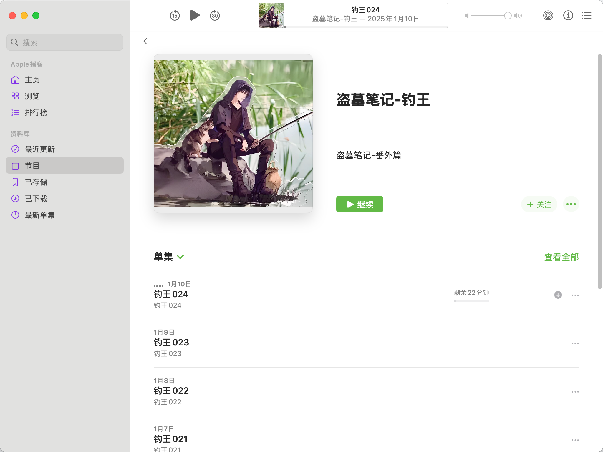

[](https://github.com/Akshay090/svg-banners)

# 🎙️ Folder2Podcast RSS

> 一键将本地音频文件夹转换为私人播客 RSS 订阅源

[English Version](README.en.md)

## 项目背景

播客 RSS 是一个强大的音频分发标准，它不仅仅是一个简单的音频列表，更提供了：

- 🔖 完整的播放进度记录
- 🎯 精确的断点续播功能
- 🔄 跨设备的收听历史同步
- 📱 多平台收听支持
- 🎨 丰富的媒体信息展示

Folder2Podcast RSS 让您可以轻松地把本地音频文件夹转换为私人播客 RSS 源，享受专业播客客户端的所有高级特性：

- 🎧 使用您最喜欢的播客应用收听（如 Apple Podcasts、Pocket Casts）
- 📱 在任何设备上继续上次的收听进度
- 🔄 自动同步多设备间的收听历史
- 📚 系统化管理您的有声内容库
- 🎯 智能记住每个音频的播放位置

只需一个命令部署，让您的本地音频秒变私人播客订阅源。

## ✨ 核心功能

- 🎯 **标准 RSS 实现** - 完整支持播客 RSS 2.0 规范和 iTunes 专有标签
- 📱 **完美客户端兼容** - 适配所有主流播客客户端
- 🔄 **智能序列化** - 自动分析文件名构建剧集顺序，生成发布时间
- 🌐 **灵活访问** - 支持中文路径和英文别名双向访问
- 🎨 **个性化配置** - 支持播客元数据自定义（标题、作者、封面等）
- 🚀 **容器化部署** - 提供 Docker 一键部署方案

## 🚀 快速开始

### Docker 一键部署（推荐）

1. **准备工作**
   - 安装 Docker
   - 准备音频文件目录（按播客内容分文件夹）
   - 规范文件命名（如：01-第一章.mp3、第02集.mp3）

⚠️ **重要：BASE_URL 配置说明**

在部署到服务器时，必须正确配置 BASE_URL 环境变量，这直接影响到：
- RSS feed 中的音频文件链接
- 封面图片链接
- 所有静态资源的访问路径

正确配置示例：
```bash
# 本地测试时
BASE_URL=http://localhost:3000

# 部署到服务器时（请替换为实际的服务器IP或域名）
BASE_URL=http://192.168.55.222:3000
# 或者
BASE_URL=http://your-domain.com
```

注意事项：
- BASE_URL 必须包含协议前缀（http:// 或 https://）
- 如果使用了自定义端口，必须包含端口号
- 结尾不要添加斜杠 '/'
- 确保该地址可以从客户端（如播客APP）访问到

2. **启动服务**

   方式一：Docker 命令直接运行
   ```bash
   docker run -d \
     -p 3000:3000 \
     -v /path/to/audiobooks:/podcasts \
     -e PORT=3000 \
     -e BASE_URL=http://your-server-ip:3000 \
     yaotutu/folder2podcast
   ```

   方式二：使用 Docker Compose（推荐）
   ```yaml
   # docker-compose.yml
   version: '3.8'
   services:
     folder2podcast:
       image: yaotutu/folder2podcast
       ports:
         - "3000:3000"
       volumes:
         - ./audiobooks:/podcasts
       environment:
         - PORT=3000
         - AUDIO_DIR=/podcasts
         - BASE_URL=http://your-server-ip:3000
       restart: unless-stopped
       healthcheck:
         test: ["CMD", "wget", "-q", "--spider", "http://localhost:3000/podcasts"]
         interval: 30s
         timeout: 10s
         retries: 3
   ```

   运行：
   ```bash
   docker compose up -d
   ```

3. **验证部署**
   - 访问 `http://localhost:3000/podcasts` 确认服务运行
   - 检查播客列表是否正确显示
   - 测试音频文件访问

### 使用 NPM 部署

1. **环境要求**
   - Node.js 14.0 或更高版本
   - NPM 6.0 或更高版本
   - 准备音频文件目录

2. **安装配置**
   ```bash
   # 克隆项目
   git clone https://github.com/your-repo/folder2podcast.git
   cd folder2podcast

   # 安装依赖
   npm install

   # 配置环境变量（可选）
   export AUDIO_DIR=/path/to/audiobooks
   export PORT=3000
   ```

3. **启动服务**
   ```bash
   # 开发模式
   npm run start:dev

   # 或指定配置启动
   AUDIO_DIR=/path/to/audiobooks PORT=3000 npm run start:dev
   ```

4. **验证服务**
   - 访问管理面板：`http://localhost:3000/podcasts`
   - 确认音频文件可访问
   - 测试播客订阅功能

### 后续配置

无论选择哪种部署方式，您都可以：
- 在各播客目录下添加 podcast.json 自定义配置
- 添加 cover.jpg 设置播客封面（推荐使用正方形图片以获得最佳显示效果）
- 通过环境变量调整全局配置

## 📱 效果展示

### 播客客户端显示效果



*图示：在 Apple Podcasts 中的显示效果*

要获取类似截图：
1. 使用任意播客客户端（如 Apple Podcasts）订阅您的播客
2. 等待内容同步完成
3. 截取播客详情页面的屏幕截图


## 📦 目录结构规范

标准的目录结构组织方式：

```
audiobooks/
├── podcast-series-1/
│   ├── 01-第一章.mp3     # 数字前缀用于排序
│   ├── 02-第二章.mp3     # 支持多种分隔符
│   ├── cover.jpg        # 可选：播客封面图片
│   └── podcast.json     # 可选：配置文件
│
└── podcast-series-2/
    ├── 01.序章.mp3      # 标准命名格式
    ├── 02.正文.mp3      # 保持命名一致性
    └── 03.尾声.mp3      # 便于维护管理
```

## ⚙️ 播客配置文件

每个播客文件夹都可以包含一个独立的 `podcast.json` 配置文件，用于自定义该播客的展示和行为。这种设计允许您为每个播客系列设置不同的配置。

### 配置文件位置
```
audiobooks/
├── 播客系列1/
│   ├── 01-第一章.mp3
│   └── podcast.json    # 播客系列1的独立配置
└── 播客系列2/
    ├── 01.序章.mp3
    └── podcast.json    # 播客系列2的独立配置
```

### 配置参数说明
```json
{
  "title": "播客标题",            // 在播客客户端中显示的标题
  "description": "播客描述",      // 播客简介
  "author": "作者名称",          // 作者信息
  "alias": "podcast-name",      // URL访问的英文标识符（选填）
  "language": "zh-cn",          // 语言代码（RFC 5646标准）
  "category": "科技",           // 播客分类
  "explicit": false,           // 内容分级标记
  "email": "contact@example.com", // 联系邮箱（选填）
  "websiteUrl": "https://example.com", // 相关网站（选填）
  "titleFormat": "full"        // 标题格式：clean或full
}
```

### 重要说明
- 每个播客可以有自己的独立配置，互不影响
- 配置文件是可选的，未配置时使用默认值
- 文件夹中的配置优先级高于全局环境变量
- 支持热更新：修改配置文件后自动生效

### 配置项详解
- **title/description**：播客的基本展示信息
- **alias**：用于创建易记的URL访问路径，必须是小写字母、数字和连字符的组合
- **language**：遵循 RFC 5646 标准的语言代码（如：zh-cn, en-us）
- **category**：播客分类，影响在客户端中的分类展示
- **explicit**：内容分级标记，用于提示是否包含敏感内容
- **titleFormat**：控制该播客的文件名显示方式，可覆盖全局设置


## 🌐 URL访问规范

系统提供两种标准的URL访问方式：

1. 原始路径访问：
```
http://[服务器地址]/audio/[播客目录名]/feed.xml
```

2. 别名路径访问：
```
http://[服务器地址]/audio/[英文别名]/feed.xml
```

访问规则说明：
- 原始路径：直接使用播客目录名，支持中文编码
- 别名路径：使用podcast.json中配置的alias值，仅支持英文和连字符
- 两种路径均指向相同的资源，提供不同的访问便利性

## 🎨 高级技巧

### 智能文件名处理

系统支持两种文件命名方式，并根据不同情况智能处理：

#### 1. 带序号的命名方式（推荐）
- 格式1：`数字 + 标题.扩展名`（例如：`01-第一章.mp3`）
- 格式2：`标题 + 数字.扩展名`（例如：`第一集01.mp3`）
- 系统优先使用文件名开头的数字作为剧集编号

#### 2. 不带序号的命名方式
- 直接使用描述性文件名（例如：`简介.mp3`）
- 系统会根据文件的创建时间和大小自动生成唯一的排序值
- 保留完整的文件名作为标题（不含扩展名）

#### 标题显示策略

可以通过全局环境变量或每个播客的配置文件来控制标题显示方式：

- **完整模式**（默认）：保留原始文件名（不含扩展名）
  ```bash
  01-简介.mp3    → "01-简介"
  第01期.mp3     → "第01期"
  简介01.mp3     → "简介01"
  ```

- **清理模式**：移除数字和分隔符（仅对带序号的文件有效）
  ```bash
  01-简介.mp3    → "简介"
  第01期.mp3     → "第期"
  简介01.mp3     → "简介"
  ```

可以通过以下方式修改标题显示策略：
1. 环境变量：`TITLE_FORMAT=clean` (默认是 full)
2. 播客配置：在 `podcast.json` 中设置 `"titleFormat": "clean"`
（文件夹配置优先级高于环境变量）

### 剧集时间管理

系统根据文件命名方式采用两种不同的时间管理策略：

1. **带序号的文件**：
   - 使用基准日期（2024-12-18）加上序号生成发布时间
   - 序号越小，发布时间越早
   - 例如：`01-简介.mp3` 的发布时间会早于 `02-正文.mp3`

2. **不带序号的文件**：
   - 使用文件的实际创建时间作为发布时间
   - 使用文件创建时间和大小生成唯一的排序值
   - 保持文件的自然时间顺序

这样的设计确保：
- 带序号的文件保持传统的连续发布时间逻辑
- 不带序号的文件保持其原有的时间属性
- 两种类型的文件可以在同一个播客中共存

## 📘 详细指南

### API使用说明

1. **播客列表接口**
   - 访问 `/podcasts` 获取所有可用播客列表
   - 返回每个播客的详细信息，包括标题、描述、订阅地址等
   - 支持中文路径和英文别名双重访问
   - Feed URL包含完整的访问地址，可直接用于播客订阅

2. **播客订阅**
   - 每个播客都有两个RSS地址可选：
     * 原始地址：`http://your-server/audio/播客文件夹名/feed.xml`
     * 别名地址：`http://your-server/audio/english-alias/feed.xml`
   - 支持所有标准播客客户端

3. **资源访问**
   - 播客封面：`/audio/播客名称/cover.jpg`
   - 音频文件：`/audio/播客名称/episode.mp3`
   - 默认资源：`/assets/default-cover.png`

### 配置说明

1. **全局配置**（环境变量）
   - `AUDIO_DIR`: 音频文件根目录
   - `PORT`: 服务器端口
   - `TITLE_FORMAT`: 标题显示格式（clean/full）
   - `BASE_URL`: 服务器基础URL（例如：http://192.168.55.222:3000），默认为 http://localhost:端口号

2. **播客配置**（podcast.json）
   - 支持每个播客文件夹单独配置
   - 可配置项：
     * title: 播客标题
     * description: 播客描述
     * author: 作者信息
     * alias: 英文访问路径
     * language: 语言代码
     * category: 分类
     * email: 联系邮箱
     * websiteUrl: 网站地址
     * titleFormat: 标题显示格式

### 最佳实践

1. **目录组织**
   - 每个播客系列独立文件夹
   - 使用数字前缀确保正确排序
   - 添加清晰的文件描述
   - 配置合适的播客信息

2. **文件命名**
   - 推荐格式：`数字-描述.mp3`
   - 示例：`01-序章.mp3`, `02-正文.mp3`
   - 支持多种分隔符：`.` `-` `_` 空格

3. **性能优化**
   - 控制单个文件夹的文件数量
   - 使用英文别名提高兼容性
   - 添加合适大小的封面图片（推荐使用正方形图片）

4. **安全性**
   - 使用只读挂载保护音频文件
   - 避免在文件名中使用特殊字符
   - 定期备份配置文件

### 故障排查

1. **系统诊断**
   - 目录权限验证
      * 确认音频文件的读取权限
      * 验证配置文件的访问权限
   - BASE_URL 配置验证
      * 检查 BASE_URL 是否正确设置（必须包含协议和端口）
      * 确认 BASE_URL 可以从外部访问
      * 验证生成的 RSS feed 中的链接是否正确
      * 测试音频文件和封面图片是否可访问
   - 资源完整性检查
     * 确认封面图片格式(cover.jpg，建议使用正方形图片)
     * 验证音频文件的有效性
     * 检查配置文件的格式规范
   - 序列化检查
     * 验证文件命名的规范性
     * 检查序号格式的一致性

2. **运行监控**
   - 日志分析
     * 定期检查运行日志
     * 分析系统错误信息
     * 监控性能指标
   - 系统状态
     * 执行定时健康检查
     * 监控服务响应时间
     * 追踪资源占用情况

3. **系统维护**
   - 定期维护计划
     * 更新系统组件
     * 清理临时数据
     * 优化存储空间
   - 性能优化
     * 监控系统负载
     * 优化目录结构
     * 执行数据备份

## ⚙️ 环境变量配置

系统支持多个环境变量来自定义行为。以下是完整的环境变量列表：

| 环境变量       | 说明                                    | 默认值                    | 示例                         |
| -------------- | --------------------------------------- | ------------------------- | ---------------------------- |
| `AUDIO_DIR`    | 音频文件根目录路径                      | `./audio`                 | `/path/to/audiobooks`        |
| `PORT`         | 服务器监听端口                          | `3000`                    | `8080`                       |
| `BASE_URL`     | 服务器基础URL，用于生成RSS feed中的链接 | `http://localhost:端口号` | `http://192.168.55.222:3000` |
| `TITLE_FORMAT` | 剧集标题显示格式                        | `full`                    | `clean` 或 `full`            |

详细说明：

1. **AUDIO_DIR**
   - 用途：指定存放音频文件的根目录
   - 默认值：当前目录下的 audio 文件夹
   - 注意：目录必须具有读权限

2. **PORT**
   - 用途：指定服务器监听的端口号
   - 默认值：3000
   - 说明：如果设置的端口被占用，服务将无法启动

3. **BASE_URL**
   - 用途：生成RSS feed中的所有URL
   - 默认值：`http://localhost:端口号`
   - 重要性：必须设置正确的值以确保音频文件可访问
   - 格式：必须包含协议（http/https）

4. **TITLE_FORMAT**
   - 用途：控制剧集标题的显示格式
   - 默认值：`full`（保留完整文件名）
   - 可选值：
     * `full`: 保留完整文件名（不含扩展名）
     * `clean`: 移除数字前缀和分隔符

使用示例：

```bash
# Docker 运行示例
docker run -d \
  -p 3000:3000 \
  -v /audiobooks:/podcasts \
  -e AUDIO_DIR=/podcasts \
  -e PORT=3000 \
  -e BASE_URL=http://192.168.55.222:3000 \
  -e TITLE_FORMAT=full \
  yaotutu/folder2podcast
```

配置优先级：
- 环境变量 > 默认值
- podcast.json 中的配置 > 环境变量（针对特定播客）

## 📱 客户端支持与使用指南

### 支持的播客客户端

几乎所有支持自定义 RSS 的播客客户端都可以使用：

- Apple Podcasts（iOS、Mac）
- Pocket Casts（全平台）
- Overcast（iOS）
- Castro（iOS）
- Google Podcasts（Android、Web）
- AntennaPod（Android）

### 使用流程

1. **获取订阅链接**
   - 访问 `http://your-server:3000/podcasts`
   - 找到您想订阅的播客系列
   - 复制对应的 RSS Feed URL

2. **添加到播客客户端**
   - 打开您喜欢的播客客户端
   - 找到"添加播客"或"添加 RSS Feed"
   - 粘贴您的 Feed URL
   - 等待内容同步完成

3. **开始使用**
   - 所有剧集会自动同步到客户端
   - 收听进度会跨设备同步
   - 支持后台下载和离线播放
   - 可以添加章节备注（部分客户端支持）

### RSS 最佳实践

1. **内容组织**
   - 每个播客系列使用独立文件夹
   - 使用 podcast.json 配置元数据
   - 添加 cover.jpg 设置封面（推荐 1400x1400px）
   - 遵循标准的文件命名规范（01-、02-）

2. **元数据优化**
   - 完善播客标题和描述
   - 选择恰当的分类（category）
   - 提供完整的作者信息
   - 使用英文别名提高兼容性

3. **访问优化**
   - 正确配置 BASE_URL
   - 确保服务器稳定可访问
   - 音频文件命名避免特殊字符
   - 定期备份重要数据

## 💡 使用提示

1. **整理策略**
   - 按系列创建文件夹
   - 用数字前缀保证顺序
   - 添加简短描述性文件名

2. **性能优化**
   - 控制单个文件夹内的文件数量
   - 定期清理不需要的文件
   - 使用SSD存储获得更好性能

3. **最佳实践**
   - 使用英文别名避免兼容性问题
   - 保持文件名简洁明了
   - 添加合适的封面图片

## 📋 支持与反馈

### 问题报告
- 发现问题请提交Issue，并提供以下信息：
  * 详细的问题描述
  * 相关的配置文件
  * 运行环境信息
  * 操作复现步骤

### 版本发布流程

项目提供了自动化版本标签管理功能：

1. **自动递增版本号**
   ```bash
   # 自动获取最新标签，将其patch版本号+1，并推送到远程仓库
   npm run tag
   ```
   例如：
   - 当前最新标签是 v0.1.1
   - 运行命令后会自动创建 v0.1.2 并推送

2. **手动创建标签**
   ```bash
   git tag v0.1.0
   git push origin v0.1.0
   ```

当新的标签被推送到 GitHub 后，会自动触发：
1. GitHub Actions 工作流
2. 构建 Docker 镜像
3. 推送到 Docker Hub

### 建议提交
- 改进建议请提供：
  * 具体的使用场景
  * 预期的功能效果
  * 可行的实现方案


## TODO

- [ ] 文件夹发生变更后,自动重新生成feed.xml,无需重启服务
- [ ] 生成opml文件,用于导入到其他podcast客户端


# Changelog

## [v0.1.6] - 2024-03-20

### ✨ 新特性 | New Features
- 新增 GitHub Actions 工作流，支持新问题、新星标和新分叉的通知 | Added GitHub Actions workflow for notifications of new issues, stars and forks
- 新增英文版 README 文档，包含预览部分和使用指南 | Added English README with preview section and usage guide

### ⚡️ 性能优化 | Performance Improvements
- 优化文件命名和剧集解析逻辑 | Enhanced file naming and episode parsing logic
- 优化剧集时间管理策略 | Refined episode time management strategy

### 📝 文档更新 | Documentation
- 更新项目名称为 Folder2Podcast RSS 并优化项目描述 | Updated project name to Folder2Podcast RSS and improved project description
- 增加环境变量配置说明及使用指南 | Added environment variables configuration guide and usage instructions

### 🔧 其他改动 | Other Changes
- 更新 package.json 脚本以支持开发和 Docker 部署 | Updated package.json scripts for development and Docker deployment
- 添加 VS Code 启动配置以支持 Node.js 调试 | Added VS Code launch configuration for Node.js debugging
- 更新开发脚本以启用 ts-node 调试功能 | Updated dev script to enable Node.js debugging with ts-node

## [v0.1.5] - 2024-03-20

### ✨ 新特性 | New Features
- 新增版本标签管理脚本 | Added tag version management script
- 添加自动递增版本号功能 | Added automatic version increment feature

### 📝 文档更新 | Documentation
- 更新文档，添加版本发布流程说明 | Updated documentation with release process instructions

## [v0.1.4] - 2024-03-20

### 🔧 其他改动 | Other Changes
- 更新标题显示策略，修改默认标题格式为完整模式 | Updated title display strategy, changed default title format to full mode

## [v0.1.3] - 2024-03-20

### ✨ 新特性 | New Features
- 优化文件扫描逻辑，跳过隐藏文件 | Enhanced file scanning logic to skip hidden files

## [v0.1.2] - 2024-03-20

### ✨ 新特性 | New Features
- 支持通过环境变量灵活配置服务器地址 | Added flexible server address configuration via BASE_URL environment variable

## [v0.1.1] - 2024-03-20

### 📝 文档更新 | Documentation
- 添加 BASE_URL 配置说明及注意事项 | Added BASE_URL configuration guide and notes
- 更新 Docker 镜像名称为 yaotutu/folder2podcast | Updated Docker image name to yaotutu/folder2podcast

## [v0.1.0] - 2024-03-20

### ✨ 新特性 | New Features
- 项目初始化 | Project initialization